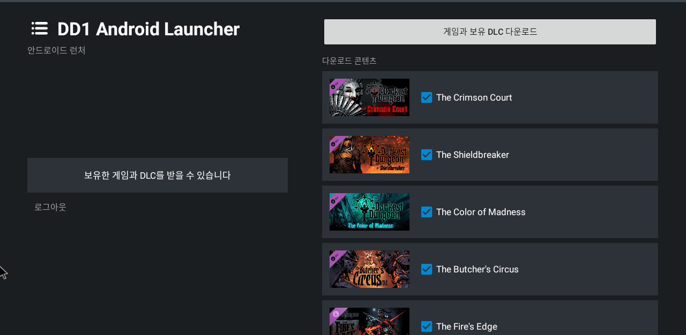
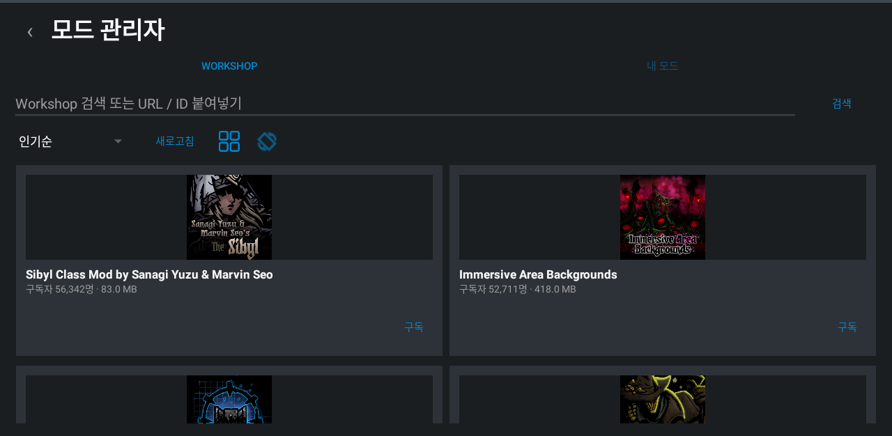
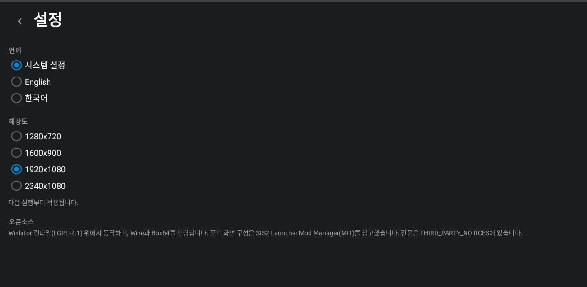

# DD1 Android Launcher

**English** · [한국어](README.ko.md)

An Android launcher that installs and runs a user-owned Windows copy of Darkest
Dungeon through the Winlator runtime — Wine and Box64 on the device. Sign in to
Steam, the launcher downloads the build the account owns, and one button starts
the game.

> **Unofficial.** Not made by, endorsed by, or affiliated with Red Hook Studios
> or Valve. It is not a port of Darkest Dungeon and contains none of it: no game
> files, no DLC, no art, no audio, no save or Steam account data, in the APK or
> in this repository. It downloads nothing you do not already own, modifies no
> game binary, and is free.

<p align="center">
  
</p>

## What it does

| | |
|---|---|
| **Install** | Steam sign-in by QR or password, ownership checked across every package, per-DLC selection, resumable-free atomic install into `files/game` |
| **Play** | One button. Touch input maps taps, drags and holds onto the game's mouse; the Android IME handles estate naming |
| **Saves** | Steam Cloud listing per profile slot, download and upload, automatic snapshots before anything is overwritten |
| **Mods** | Workshop search and browse, subscribe, queued download, update detection, enable/disable, local ZIP import |
| **Battery** | Resolution, processor cores and screen refresh rate, each measured against the others rather than guessed at |

### Battery

The game has no frame limit and nothing in the stack can give it one, so it
renders as fast as the phone allows and spends the battery doing it. Measured on
a Galaxy S25, off charge:

| Settings | Battery | Hottest core |
|---|---|---|
| 1920x1080, all cores, 120 Hz | 24 %/h | 83 °C |
| 1280x720, all cores, 120 Hz | 21.8 %/h | 59 °C |
| 1280x720, all cores, faster translation | 28.8 %/h | 63 °C |
| **1280x720, efficiency cores, 60 Hz** | **14.6 %/h** | **56 °C** |

Two and a half hours of play becomes four and a half. The draw is in translating
x86, not in drawing pixels, which is why holding the runtime off the fastest
cores wins where lowering the resolution barely moves it — and why box64's
faster preset *costs* battery: the game spends every bit of the headroom on
frames nobody sees.

### Mod manager

Workshop browsing with preview images, sorting, and a column count that follows
the screen. Subscriptions made anywhere — including on a PC — are pulled down
automatically, and items unsubscribed there are removed here.

<p align="center">
  
  
</p>

### Saves and settings

Each profile slot shows what is on the device beside what is in Steam Cloud, so
a transfer is a deliberate act in a named direction. A slot that will not come
down says so rather than half-restoring.

<p align="center">
  
  
</p>

## Getting it running

1. **Install the APK** from [Releases](../../releases). Android will warn about
   an app from outside the store, and about its compatibility — both are
   expected, and the second one is explained under [Notes](#notes).
2. **Sign in to Steam.** Scan the QR code with the Steam mobile app, or type an
   account and password and approve the request on your phone. Nothing is stored
   but the refresh token Steam hands back, encrypted with the Android Keystore.
3. **Pick your DLC** from the list of what the account owns, and press download.
   Only what is ticked is fetched. About 4 GB over Wi-Fi; leave the screen on and
   the app in front, and read the byte count rather than the percentage.
4. **Press Play.** The first launch unpacks the runtime and takes a few minutes.
   After that it goes straight in.

## Playing by touch

| | |
|---|---|
| **Tap** | Left click |
| **Drag** | Left click and hold — moving the party, moving items between bags |
| **Hold still** | Right click — using an item on a hero |
| **Four fingers** | The launcher's drawer |
| **ESC** / **ABC** | Escape, and the Android keyboard for naming the estate |

A tap leaves the cursor where it touched, which is how tooltips appear: touch an
item and the game describes it.

## Requirements

- ARM64 Android device, Android 8 or newer
- A Steam account that owns Darkest Dungeon (app `262060`)
- About 5 GB free: the game is roughly 4 GB and staging needs room
- **Wi-Fi.** Mobile carriers routinely hand out Steam content servers that
  answer small requests and never answer large ones, which stalls the download

## Build

Android SDK 34, NDK `24.0.8215888`, CMake 3.22.1.

```sh
./gradlew assembleDebug testDebugUnitTest    # what every change must pass
./gradlew assembleRelease                    # signed if keystore.properties exists
```

Release signing reads `keystore.properties` from the repository root — absent,
the build still produces an unsigned APK rather than failing:

```properties
storeFile=dd1-release.jks
storePassword=...
keyAlias=dd1
keyPassword=...
```

## Testing

Unit tests run on the host. UI tests run against Waydroid in a Gamescope window;
its x86_64 bridge cannot execute the ARM64 runtime, so gameplay itself is only
ever verified on a real phone.

```sh
./gradlew connectedDebugAndroidTest          # Waydroid only
```

Never run instrumentation against a phone that holds the game: Gradle uninstalls
the app afterwards and takes the 4 GB install and the Wine prefix with it.

## Notes

`applicationId` is fixed at `com.winlator`. The Winlator root filesystem bakes
`/data/data/com.winlator` into box64's ELF interpreter, wineserver, ntdll and
`ld.so.cache` in fixed-size fields, so changing it needs a same-length id and a
rewrite pass over the extracted tree.

`targetSdkVersion` stays at 28. Android 29 and newer forbid executing files in
the app data directory, which is exactly where the runtime unpacks box64 and
Wine. The compatibility warning Android shows for this is expected.

## What this is not

Darkest Dungeon belongs to Red Hook Studios, and their EULA licenses it for
personal gameplay. That is exactly what this does: it runs the Windows build you
bought, unmodified, on hardware you own. It is not a port and does not
redistribute the game — without your own Steam account that owns it, this
launcher has nothing to run.

An official iPad edition exists. If you want Darkest Dungeon on a tablet and
that fits your device, buy it there; it is the version Red Hook made money on.

## Upstream and licenses

Winlator revisions and third-party attribution are recorded in [`NOTICE`](NOTICE)
and [`THIRD_PARTY_NOTICES`](THIRD_PARTY_NOTICES). The source stays under the
upstream LGPL-2.1 terms in [`LICENSE`](LICENSE); bundled components keep their
own.
