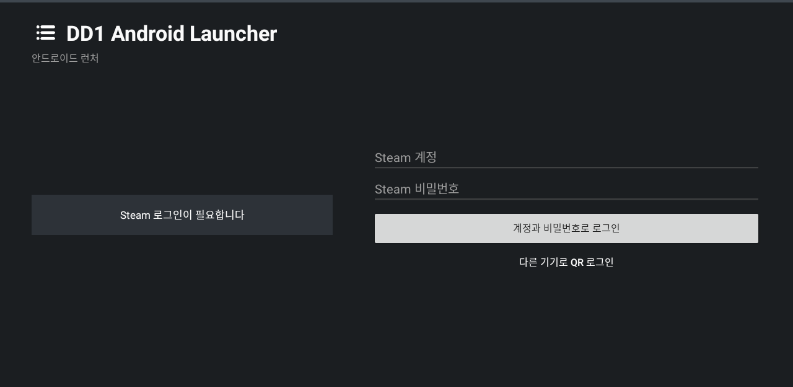
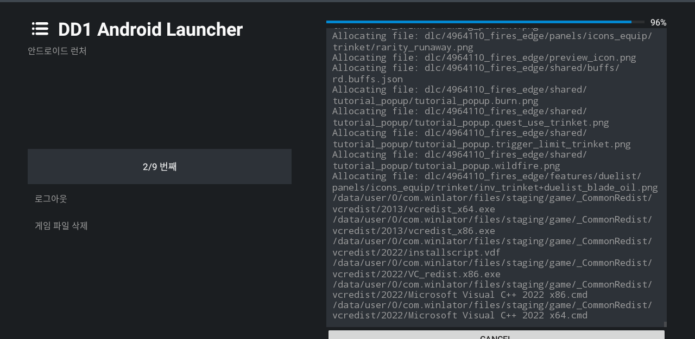
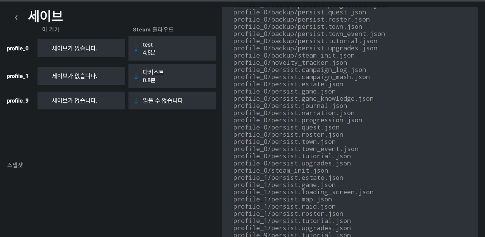
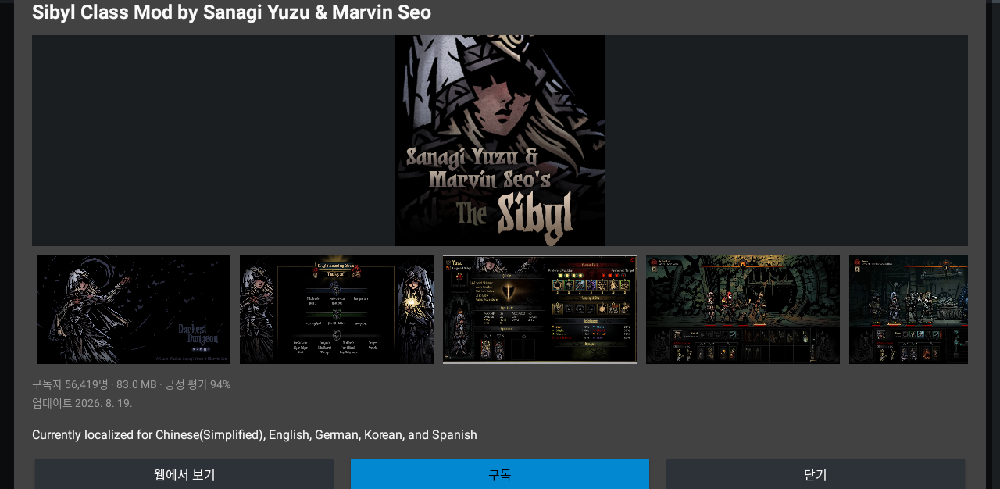
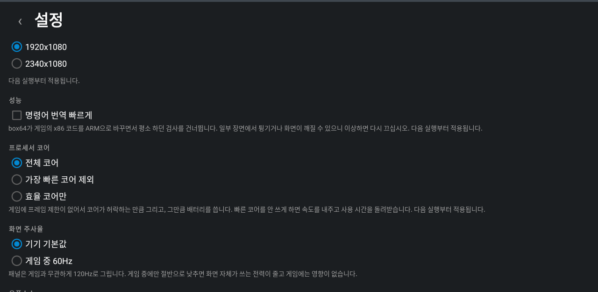

# DD1 Android Launcher

**English** · [한국어](README.ko.md)

An Android launcher that installs and runs a user-owned Windows copy of Darkest
Dungeon through the Winlator runtime — Wine and Box64 on the device. Sign in to
Steam, the launcher downloads the build the account owns, and one button starts
the game.

> **Unofficial.** Not made by, endorsed by, or affiliated with Red Hook Studios
> or Valve. It is not a port of Darkest Dungeon and contains none of it: no game
> files, no DLC, no art, no audio, no save or Steam account data, in the APK or
> in this repository. It downloads nothing you do not already own, modifies no
> game binary, and is free.

<p align="center">
  
</p>

## What it does

| | |
|---|---|
| **Install** | Steam sign-in by QR, or account and password with a phone approval or a Steam Guard code. Ownership checked across every package, the DLC list read from Steam's own table, per-DLC selection, resumable-free atomic install into `files/game` |
| **Play** | One button. Touch input maps taps, drags and holds onto the game's mouse; the Android IME handles estate naming |
| **Saves** | Steam Cloud listing per profile slot, download and upload, automatic snapshots before anything is overwritten |
| **Mods** | Workshop search and browse, subscribe, queued download, update detection, enable/disable, local ZIP import |
| **Battery** | Resolution, processor cores and screen refresh rate, each measured against the others rather than guessed at |

### Battery

The game has no frame limit and nothing in the stack can give it one, so it
renders as fast as the phone allows and spends the battery doing it. Measured on
a Galaxy S25, off charge:

| Settings | Battery | Hottest core |
|---|---|---|
| 1920x1080, all cores, 120 Hz | 24 %/h | 83 °C |
| 1280x720, all cores, 120 Hz | 21.8 %/h | 59 °C |
| 1280x720, all cores, faster translation | 28.8 %/h | 63 °C |
| **1280x720, efficiency cores, 60 Hz** | **14.6 %/h** | **56 °C** |

Two and a half hours of play becomes four and a half. The draw is in translating
x86, not in drawing pixels, which is why holding the runtime off the fastest
cores wins where lowering the resolution barely moves it — and why box64's
faster preset *costs* battery: the game spends every bit of the headroom on
frames nobody sees.

### Mod manager

Workshop browsing with preview images, sorting, and a column count that follows
the screen. Subscriptions made anywhere — including on a PC — are pulled down
automatically, and items unsubscribed there are removed here.

### Saves and settings

Each profile slot shows what is on the device beside what is in Steam Cloud, so
a transfer is a deliberate act in a named direction. A slot that will not come
down says so rather than half-restoring.

## Getting it running

From an empty phone to a party in a dungeon. Everything here happens on one
screen; the drawer at the top left holds the rest.

### 1. Install the APK

Download it from [Releases](../../releases) and open it. Android asks twice:
once to allow an app from outside the store, and once about compatibility.

> **"This app was built for an older version of Android"**
> Expected, and not a mistake. Android 10 and newer forbid running programs out
> of an app's own data directory, which is exactly where Wine and Box64 have to
> be unpacked. Staying on the older target is what keeps the runtime legal to
> execute. Press through it.

### 2. Sign in to Steam

<p align="center">
  
</p>

The launcher opens on a sign-in panel. Two ways in:

- **QR** — press *Sign in on another device* and scan the code with the Steam
  mobile app. Nothing is typed on the phone. **This one needs the mobile
  authenticator.**
- **Account and password** — type them, and Steam Guard asks for whatever that
  account uses.
  - With the mobile authenticator, you **approve** in that app and type nothing
  - Without it, Steam **emails a code**, and a box for it appears in the same
    place. An account asked for the authenticator app's six digits uses the same
    box

> **What is kept**
> Only the refresh token Steam hands back, encrypted with the Android Keystore.
> The password is never stored and never written to a log.

The log on the right reports what it found: `Reading N Steam licenses`, then
`Darkest Dungeon ownership verified`. DLC is counted across every package on the
account, so a bundle bought years ago still shows up.

### 3. Choose the DLC, then download

<p align="center">
  
</p>

The right half fills with the DLC the account owns, all ticked. **Untick what
you do not want before pressing download** — unticked DLC is never fetched, so
a change of mind afterwards means downloading it separately.

> **Butcher's Circus** is multiplayer only and needs Steam networking that does
> not work here. Leaving it out saves about 540 MB.

Press **Download the game and owned DLC**. What to watch while it runs:

<p align="center">
  
</p>

| On screen | What it means |
|---|---|
| `3/8 번째` · `3/8` | Which depot of how many is in hand. The parts are wildly uneven — the base game alone is most of the 4 GB and can sit on one number for twenty minutes |
| The percentage | Per depot, not overall. It drops back when a part finishes; that is normal |
| The log | The file being written right now. This is the honest progress: if names keep scrolling, bytes are moving |
| The notification | The same figures in the shade, so the screen can go dark |

> **Use Wi-Fi.** On mobile data the Steam content servers handed out answer
> small requests and never answer large ones, and the download stalls with no
> way to tell it from a dead connection. This is not something the launcher can
> fix — the servers are assigned by Steam.

Cancelling returns to the DLC list with nothing lost but the bytes. A download
that fails leaves the install untouched: staging is discarded, never merged
half-finished.

### 4. Press Play

The first launch unpacks the runtime and can take a few minutes on the
*Preparing the runtime* screen. After that it goes straight to the game.

The game creates its own save on first run, so a fresh estate is normal. If you
already have one, bring it down before you play — see below.

### 5. Bring saves down from Steam Cloud

<p align="center">
  
</p>

Drawer → **Saves**. Each profile slot shows what is on the phone beside what is
in Steam Cloud, so a transfer is always a deliberate act in a named direction.

| | |
|---|---|
| ↓ beside a cloud slot | Download it onto the phone |
| ↑ beside a device slot | Upload the phone's copy |
| **Snapshots** | Automatic copies taken before anything is overwritten |

A slot that cannot be downloaded whole says so and changes nothing — half a save
is a save nobody can load. Steam sometimes lists a file it has no content for,
usually in a slot never really played; that slot reports *unreadable* and the
rest are unaffected.

> Play on one device at a time. Steam Cloud has no way to merge two estates.

### 6. Mods

<p align="center">
  
  
</p>

Drawer → **Mod manager**. Subscriptions made anywhere — including on a PC — are
pulled down when the screen opens, and anything unsubscribed there is removed
here.

| Tab | What it holds |
|---|---|
| **Workshop** | Search by name, or paste a Workshop URL or ID. Sort by popularity, date or rating; the grid button cycles 2, 3 and 4 columns. Tap a card for the full description and screenshots |
| **My mods** | What is installed, what has an update waiting, and what is switched off. **Import ZIP** adds a mod by hand |

Downloads run one at a time and the notification says which: `3/12 · Plague
Doctor skins mod · 42%`. Nothing is swapped into the game until a mod has
arrived whole, and nothing is touched while the game is running.

Then turn mods on **inside the game**, on the campaign screen — that list is
part of the save, and the launcher does not edit saves.

### 7. Make it last

<p align="center">
  
</p>

Drawer → **Settings**. The defaults are safe; these are worth changing:

| Setting | Why |
|---|---|
| **Resolution → 1280x720** | The game renders 720p anyway. Fewer pixels, 24 °C off the hottest core, no visible difference |
| **Processor cores → Efficiency cores only** | The largest single win. See [Battery](#battery) |
| **Screen refresh rate → 60 Hz while playing** | The panel runs at 120 Hz whatever the game does |
| **Faster instruction translation** | Leave it **off**. It buys speed the game spends on frames nobody sees, and costs 7 %/h |

### 8. Updating

**The launcher** takes a new APK installed over the old one. Game files, saves,
mods and the Steam session all survive. Do not uninstall first - that costs you
the 4GB again.

**DLC** lives under the drawer, **Content**. When Red Hook patches one, this
screen says so first.

| Line | Meaning |
|---|---|
| `Not downloaded yet: ...` | Owned, but not on this device |
| `Update available: ...` | Steam has a newer version than the one you hold |

**Fetch selected content** takes both lines and merges them into the install you
already have. It asks for that DLC's depots rather than the whole game, so it is
usually minutes. Progress shows in the log and the notification on the home
screen - the same place the first download reported.

The version of each DLC on the device is recorded outside the game folder, so
rebuilding the install does not lose track of what is current.

**Workshop mods** are re-read every time the mod manager opens. Whether you
subscribed on a PC or the author patched a mod, it surfaces here and starts
fetching what is missing. Three places show how far it has got.

- The **My mods** tab puts an **Update** button on any mod with a newer version
- **Install and update** appears at the bottom only while something is still
  pending. Pressing it fills the bar at the bottom of the screen and the bar on
  the card of the mod being fetched
- The notification carries the queue position: `3/12 · Plague Doctor skins mod ·
  42%`. Twelve mods in, you can put the screen away and still know where it is

A mod moves into the game folder only once it has arrived whole. If it is cut
off, only that mod is fetched again next time; the ones already in stay.

## Playing by touch

| | |
|---|---|
| **Tap** | Left click |
| **Drag** | Left click and hold — moving the party, moving items between bags |
| **Hold still** | Right click — using an item on a hero |
| **Four fingers** | The launcher's drawer |
| **ESC** / **ABC** | Escape, and the Android keyboard for naming the estate |

A tap leaves the cursor where it touched, which is how tooltips appear: touch an
item and the game describes it.

## If something goes wrong

### If it looks like this

<p align="center">
  
</p>

The quest name, the torch, the hero panel, the inventory and the narration are
all there, but **the dungeon or the estate is not drawn and stays black.** The
game has not hung; the graphics driver cannot draw its picture. DD1 draws the
world into a framebuffer and lights it with a shader, and the interface does not
go through that path - which is why one shows and the other does not.

> The figure above is a drawing of the symptom, not a capture of the game. No
> game imagery is kept in this repository.

**Drawer, Settings, scroll to the bottom: read the two lines under `Graphics`.**
They name the GPU and the drivers in force.

<p align="center">
  
</p>

Quote those two lines in the issue. Most of the time they are enough to narrow it
down. Also worth having:

- **Device model and Android version** - Settings, About phone, Software
  information
- **A screenshot of the black screen.** What draws and what does not is the
  clue: interface-only and everything-black have different causes
- **Where it happens** - from the start, or only in the dungeon while the estate
  is fine

A log is better still. From a PC with the phone on USB:

```
adb logcat -d > dd1.log
```

### The app will not open

It closes the moment it starts, and pressing it again does the same: **install
0.1.5 or newer over it.** An app killed while it was making its runtime profile
would not start again afterwards, and 0.1.5 repairs that at startup. Game files
and saves are not lost, so do not uninstall - that costs you the 4GB again.

### A save will not upload

The log on the save screen says what was sent and
what was refused, and `adb logcat -d | grep DD1Cloud` carries the reason Steam
gave, verbatim. Paste that line.

### The game says a DLC is missing

Open the content screen: it lists what the
account owns and what has not been downloaded yet. If it is listed but not
downloaded, fetch it there. If a DLC you own is not listed at all, that is a bug
in the launcher - please report it.

## Requirements

- ARM64 Android device, Android 8 or newer
- A Steam account that owns Darkest Dungeon (app `262060`)
- About 5 GB free: the game is roughly 4 GB and staging needs room
- **Wi-Fi.** Mobile carriers routinely hand out Steam content servers that
  answer small requests and never answer large ones, which stalls the download

## Build

Android SDK 34, NDK `24.0.8215888`, CMake 3.22.1.

```sh
./gradlew assembleDebug testDebugUnitTest    # what every change must pass
./gradlew assembleRelease                    # signed if keystore.properties exists
```

Release signing reads `keystore.properties` from the repository root — absent,
the build still produces an unsigned APK rather than failing:

```properties
storeFile=dd1-release.jks
storePassword=...
keyAlias=dd1
keyPassword=...
```

## Testing

Unit tests run on the host. UI tests run against Waydroid in a Gamescope window;
its x86_64 bridge cannot execute the ARM64 runtime, so gameplay itself is only
ever verified on a real phone.

```sh
./gradlew connectedDebugAndroidTest          # Waydroid only
```

Never run instrumentation against a phone that holds the game: Gradle uninstalls
the app afterwards and takes the 4 GB install and the Wine prefix with it.

## Notes

`applicationId` is fixed at `com.winlator`. The Winlator root filesystem bakes
`/data/data/com.winlator` into box64's ELF interpreter, wineserver, ntdll and
`ld.so.cache` in fixed-size fields, so changing it needs a same-length id and a
rewrite pass over the extracted tree.

`targetSdkVersion` stays at 28. Android 29 and newer forbid executing files in
the app data directory, which is exactly where the runtime unpacks box64 and
Wine. The compatibility warning Android shows for this is expected.

## What this is not

Darkest Dungeon belongs to Red Hook Studios, and their EULA licenses it for
personal gameplay. That is exactly what this does: it runs the Windows build you
bought, unmodified, on hardware you own. It is not a port and does not
redistribute the game — without your own Steam account that owns it, this
launcher has nothing to run.

An official iPad edition exists. If you want Darkest Dungeon on a tablet and
that fits your device, buy it there; it is the version Red Hook made money on.

## Upstream and licenses

Winlator revisions and third-party attribution are recorded in [`NOTICE`](NOTICE)
and [`THIRD_PARTY_NOTICES`](THIRD_PARTY_NOTICES). The source stays under the
upstream LGPL-2.1 terms in [`LICENSE`](LICENSE); bundled components keep their
own.
