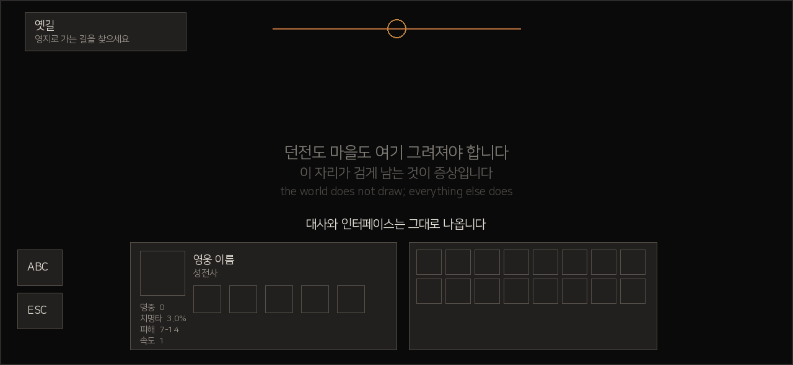
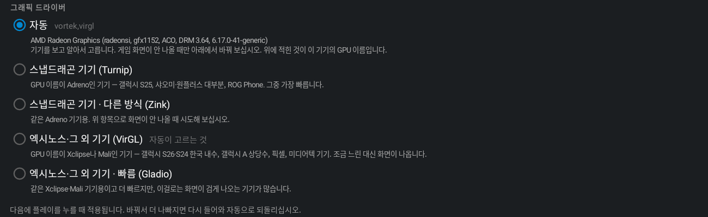

# 릴리스 노트

새 릴리스가 위에 옵니다. 릴리스 본문에 그대로 붙여 쓰는 글입니다.

## 0.1.3

세 가지 버그를 고쳤습니다. 세 개가 같은 모양이었습니다 — 런처가 Steam이나 기기에게
물어보면 되는 것을 코드에 적어둔 목록으로 대신하고 있었고, 그 목록에 없는 것은 존재하지
않는 셈이 되었습니다.

### 세이브가 Steam 클라우드로 올라가지 않던 문제

**한 번도 성공한 적이 없었습니다.** Steam은 이미 같은 내용으로 갖고 있는 파일에 대해
"중복 요청"이라고 답합니다. 보낼 것이 없다는 뜻이고, 이미 보낸 것과 같은 상태입니다.
런처는 그것을 실패로 읽고 그 자리에서 슬롯 전체를 포기했습니다. 그리고 슬롯에서 가장
먼저 처리되는 파일이 거의 변하지 않는 파일이라, 첫 파일이 항상 중복이었습니다.

이제 변하지 않은 파일은 넘어가고 변한 것만 올립니다. 바뀐 것이 없는 슬롯을 다시
동기화하면 아무것도 보내지 않고 성공으로 끝납니다.

같이 고친 것: Steam이 거부한 이유가 로그에 남습니다. 예전에는 "커밋되지 않음"이라는
말만 있어서 무엇이 잘못됐는지 알 방법이 없었고, 그것이 이 버그가 오래 남아 있던 이유
입니다.

### 총사(The Musketeer) DLC가 설치되지 않던 문제

무료 DLC라 모든 구매자가 보유하고 있고, 모든 구매자가 받지 못하고 있었습니다. 런처가
DLC 목록을 코드에 적어둔 다섯 개짜리 표에서 읽고 있었고 총사는 그 표에 없었습니다.
목록에 없으니 화면에도 뜨지 않고, 선택되지도 않고, 다운로드되지도 않아서, 게임이
DLC가 없다고 말했습니다.

이제 목록을 Steam이 게임 정보로 내려주는 DLC 표에서 읽습니다. 앞으로 Red Hook이 DLC를
추가하면 런처를 고치지 않아도 그날부터 목록에 나타납니다.

덤으로, 여태 조용히 지나갔던 업데이트도 드러납니다 — 콘텐츠 화면에서 The Color of
Madness와 The Fire's Edge가 최신이 아니라고 알려 줍니다.

### 게임 화면이 검게 나오던 문제

**이런 현상이 있는 경우입니다.**

  

퀘스트 이름, 횃불, 영웅 창, 가방, 대사까지 다 나오는데 던전이나 마을만 검게 남습니다.
(증상을 그린 그림이며 게임 화면 캡처가 아닙니다.)

런처는 GPU 이름에서 모델 번호를 읽어 그래픽 드라이버를 고르는데, 여섯백·칠백·팔백번대
세 자리만 인식했습니다. 그 밖의 이름을 가진 Adreno는 "Adreno가 아닌 것"으로 처리되어
다른 드라이버를 받았고, 프로필의 나머지 설정은 Adreno 기준으로 맞춰져 있었습니다.
최신 기기에서 이 구멍에 빠집니다.

DD1은 게임 화면을 프레임버퍼에 그린 뒤 셰이더로 조명을 씌우고, 인터페이스는 그 경로를
타지 않습니다. 그래서 한쪽만 보입니다.

이제 번호가 아니라 이름으로 판단합니다. 이미 만들어진 프로필도 기기에 맞게 교정되므로,
업데이트만 하면 됩니다.

**다만 이것이 원인이라고 확정하지는 못했습니다.** 증상과 코드의 결함이 맞아떨어진다는
것까지가 지금 말할 수 있는 전부입니다. 그래서 아래를 같이 넣었습니다.

### 설정 화면에 그래픽 정보 추가

**위와 같은 현상이 있으면 서랍 → 설정 → 맨 아래 `그래픽` 항목의 두 줄을 봐 주십시오.**
GPU 이름과 지금 쓰는 드라이버가 적혀 있습니다.

  

**이슈를 올릴 때 첨부해 주실 것:**

1. 위 두 줄 (그대로 적어 주시면 됩니다)
2. 기기 모델명과 안드로이드 버전 — 설정 → 휴대전화 정보 → 소프트웨어 정보
3. 검은 화면 스크린샷 — 인터페이스만 보이는 것과 전부 검은 것은 원인이 다릅니다
4. 어디서 그렇게 되는지 — 처음부터인지, 마을은 정상인데 던전만인지

로그까지 있으면 가장 좋습니다. USB로 연결한 PC에서 `adb logcat -d > dd1.log`.

세이브나 DLC 쪽 문제도 무엇을 보면 되는지 함께 정리해 두었습니다 —
README의 [문제가 생기면](../README.ko.md#문제가-생기면).

### 업데이트하는 방법을 README에 정리

이번에 The Fire's Edge가 실제로 업데이트됐는데, 그런 걸 어디서 보고 어떻게 받는지가
문서에 없었습니다. [업데이트](../README.ko.md#8-업데이트) 절을 새로 넣었습니다 — 런처
자체, DLC, 창작마당 모드 세 가지를 각각, 그리고 창작마당 동기화가 어디까지 왔는지 보는
곳 세 군데(내 모드 탭의 업데이트 표시, 화면 아래 진행 막대, 알림의 큐 위치)를 적었습니다.

### 내부 정리

동작에 드러나는 변화는 없습니다. 런타임이 이미 제공하는 파일·스트림 유틸리티를 쓰도록
바꾸고, 쓰이지 않던 코드 두 덩이와 의존성 하나를 지웠습니다(약 460줄). DLC 커버 그림은
모드 이미지 캐시를 쓰게 되어 크기 제한과 축소 처리가 함께 적용되고, 목록의 커버를 다시
동시에 내려받습니다.
