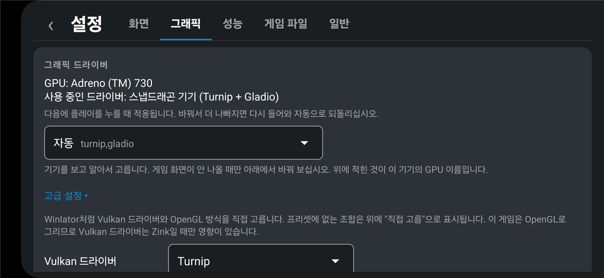

# 릴리스 노트

새 릴리스가 위에 옵니다. 릴리스 본문에 그대로 붙여 쓰는 글입니다.

## 다음 버전 (미출시)

### 다운로드가 끊겨도 처음부터 다시 받지 않습니다

**받던 다운로드가 멈추면 받은 부분을 남겨 두고 이어서 받습니다.** 지금까지는 Steam
서버가 3분 동안 응답하지 않으면 다운로드를 멈췄고, 다시 누르면 받은 것을 전부 지우고
처음부터 받았습니다. 연결이 느리거나 불안하면 데이터만 쓰고 진행률은 늘 제자리였던
이유입니다.

- 멈추면 잠시 뒤 다른 서버로 자동으로 다시 시도합니다. 최대 6번입니다
- 이어 받기 전에 이미 받은 파일을 조각 단위로 Steam의 체크섬과 대조합니다. 반쯤 쓰다
  만 파일이나 내용이 비어 있는 파일은 그 부분만 다시 받습니다
- 동시에 받는 연결 수를 2개에서 4개로 늘렸습니다

### 게임 폴더를 런처에서 열 수 있습니다

**홈 화면에 게임 파일 열기와 게임 파일 검사 및 복구가 생겼습니다.**

- **게임 파일 열기**는 게임을 켜지 않고 런타임의 파일 매니저만 띄웁니다. 게임은
  `G:`, 휴대폰의 Download 폴더는 `D:`, 내부 저장공간 전체는 `E:`입니다. `winmm.dll`
  처럼 `_windows/win64`에 넣어야 하는 파일을 여기서 넣고 뺄 수 있습니다
- 지금까지는 게임이 실행 중일 때만 폴더에 들어갈 수 있어서, 넣은 파일 때문에 게임이
  켜지지 않으면 그 파일을 뺄 방법도 없었습니다
- **게임 파일 검사 및 복구**는 설치된 파일을 Steam 원본과 비교해서 달라진 부분만 다시
  받습니다. 덮어쓴 `Darkest.exe` 같은 것을 되돌릴 때 재설치가 필요 없습니다. 직접 넣은
  DLL처럼 Steam에 없는 파일은 지우지 않으니, 그런 파일은 게임 파일 열기에서 빼세요

### 던전 이동 버튼

**오른쪽 여백에 ◀ ▶ 버튼이 생겼습니다.** 누르고 있는 동안 파티가 그 방향으로
걷습니다(A/D 키). 끌어서 이동하면 프레임이 떨어지던 문제를 피할 수 있습니다.

### 큰 모드

**모드 크기 제한 512 MB를 없앴습니다.** 400 MB짜리 통합팩 ZIP은 풀면 512 MB를 넘어서
들어오지 않았습니다. 이제는 휴대폰에 남은 공간만큼 들어오고, 공간이 모자라면 그렇게
알려 줍니다.

### 게임을 다시 받아도 모드가 남습니다

**게임을 재설치하거나 업데이트해도 설치된 모드를 지우지 않습니다.** 모드는 게임 폴더
안에 있어서 게임 폴더를 새로 바꿀 때 같이 사라졌고, 그래서 창작마당 모드를 전부 처음부터
다시 받았습니다.

### 윈레이터와 함께 설치하는 APK

**윈레이터(또는 그 포크)가 이미 깔려 있어도 설치되는 APK를 따로 냅니다.** 파일 이름에
`beside-winlator`가 붙은 쪽입니다.

- 기존 APK와는 Android가 다른 앱으로 봅니다. 그래서 이쪽으로 옮기면 게임을 처음부터
  다시 받아야 합니다(약 3.7 GB). 세이브는 Steam 클라우드나 `DD1/saves` 백업으로 옮기세요
- 윈레이터를 쓰지 않는다면 지금 쓰는 APK를 그대로 쓰면 됩니다

## 0.1.12

### 세이브가 앱 밖에도 남습니다

**앱을 지워도 세이브가 살아남는 사본이 생겼습니다.** 지금까지 세이브는 전부 앱 안에
있어서 파일 매니저로 닿을 수 없었고, 앱을 지우면 같이 사라졌습니다.

- 런처가 열릴 때와 게임을 마치고 돌아올 때, 세이브가 바뀌었으면 자동으로 한 벌을
  복사합니다. 최신 3벌만 남습니다

```
내부 저장공간/DD1/saves/auto
```

- 세이브 화면의 **저장공간으로 복사** 버튼은 지금 세이브 전체를 `DD1/saves/<시각>`에
  남깁니다. 이쪽은 자동으로 지워지지 않습니다 — 직접 지우기 전까지 남는 보관용입니다
- 파일 이름과 폴더 구조를 바꾸지 않고 그대로 복사합니다. 되돌릴 일이 생기면 게임을 끈
  상태에서 해당 파일을 원래 자리에 도로 복사하면 됩니다
- 저장공간 권한이 필요합니다. 모드 폴더를 쓰면서 이미 허용했다면 그대로 동작하고,
  아니면 버튼을 처음 누를 때 묻습니다. 허용 전에는 자동 복사도 조용히 기다립니다

### 만료된 로그인이 에러만 반복하게 될 문제

**Steam이 저장된 로그인을 거절하면 이제 로그인 화면으로 돌아갑니다.** 저장된 세션은
몇 달이 지나면 Steam이 더 받아 주지 않는데, 지금까지는 거절된 세션을 지우지 않아서
그때가 오면 매번 같은 에러만 보여 주고 빠져나갈 길이 없었습니다. 미리 고쳐 둡니다.
일시적인 연결 문제는 예전처럼 에러를 보여 주고 같은 세션으로 다시 시도합니다.

## 0.1.11

### 모드를 폴더에 넣어서 관리합니다

**모드 폴더가 생겼습니다.** 컴퓨터에서 하듯 폴더에 모드를 넣고 빼면 됩니다.

```
내부 저장공간/DD1/mods
```

- 모드 매니저를 열 때와 **새로고침**을 누를 때 이 폴더를 읽습니다. 생긴 것은 들여오고,
  없어진 것은 목록에서도 지웁니다
- 압축을 푼 폴더도, ZIP 파일 그대로도 받습니다. `project.xml`이 있는지로 판단합니다
- **ZIP 가져오기**는 이제 이 폴더에 압축을 풀고 나서 읽어들입니다. 그래서 ZIP으로 넣은
  모드도 폴더에서 빼면 사라집니다. 모드가 어디에 있는지가 한 곳입니다
- 목록에서 모드를 삭제하면 폴더의 원본까지 지웁니다. 그러지 않으면 다음에 화면을 열 때
  다시 들어옵니다
- 폴더 경로는 **변경**으로 바꿀 수 있습니다. 바꾸면 지금 폴더가 설치한 로컬 모드는
  제거되고 새 폴더를 읽습니다. 창작마당 모드는 어느 경우에도 영향받지 않습니다
- 설치된 목록이 **로컬 모드**와 **스팀 창작마당**으로 나뉩니다

이 화면을 처음 열 때 저장공간 권한을 한 번 묻습니다. 폴더를 읽는 데만 씁니다.

### ZIP으로 넣은 모드가 아무 일도 일어나지 않은 채 사라지던 문제

**창작마당을 거치지 않은 모드를 ZIP으로 넣을 수 있게 됐습니다.** 지금까지는 파일을 고르고
돌아와도 모드가 들어오지 않았고, 왜 안 됐는지도 말해 주지 않았습니다. 세 가지가 겹쳐
있었습니다.

- 파일 선택기가 화면을 가져가는 동안 런처는 설치 서비스와의 연결을 놓습니다. 돌아와서
  다시 연결하는 일은 파일을 받는 쪽보다 늦게 끝나므로, 고른 파일은 대개 아무에게도
  전달되지 않고 버려졌습니다. 이제는 연결이 돌아올 때까지 들고 있습니다
- 설치된 목록은 디스크에 있는 것인데, 스팀 응답을 기다리는 동안과 실패했을 때 그 목록이
  비워졌습니다. 로그인하지 않았거나 연결이 없으면 ZIP으로 넣은 모드는 스팀과 아무 상관이
  없는데도 목록에서 함께 사라졌고, 화면을 열 때마다 새로 고치므로 넣은 직후에만 보였습니다.
  이제 목록은 남고 메시지만 바뀝니다
- 파일 선택기가 ZIP만 고를 수 있도록 걸어 둔 조건이, 파일이 기기에 어떻게 들어왔는지에
  따라 그 ZIP을 회색으로 만들었습니다. 이제 종류를 가리지 않고, 안에 `project.xml`이
  있는지로 판단합니다

## 0.1.10

### 컨트롤러로 Y를 누르면 키보드가 떠 버리던 문제

**게임 중에 Winlator 메뉴가 열리지 않게 바뀌었습니다.** 컨트롤러로 플레이하던 분이 알려주신
문제인데, 원인은 이랬습니다. Y는 게임에 배정된 버튼이 아니라서 안드로이드가 이를 뒤로가기로
바꾸고, 런타임은 뒤로가기에 왼쪽 메뉴를 여는 것으로 답하며, 그 메뉴의 첫 항목이 하필
`Keyboard`입니다. 그래서 두 번 누르면 키보드가 게임 위에 올라왔습니다.

- 이제 그 메뉴는 기본으로 열리지 않습니다. 뒤로가기도, 컨트롤러 버튼도, 네 손가락 탭도
  아무 일도 하지 않습니다
- 런타임 자체의 키보드나 작업 관리자, 종료가 필요하면 **설정 → Winlator 메뉴**에서 켜십시오
- 컨트롤러 입력 자체는 아무것도 가져가지 않습니다. 버튼은 예전처럼 게임으로 갑니다

### 키보드를 내린 뒤 버튼이 제자리로 돌아오지 않던 문제

키보드를 한 번 올리고 내리면 ABC·ESC·SHIFT+CTRL 버튼이 화면 중간에, 좌우로도 화면 끝에
붙은 채 남아 있었습니다. 버튼을 놓는 코드가 키보드가 떠 있을 때 예약된 값으로 자리를
정하는 경우가 있어서, 키보드가 사라진 뒤에 그 값이 도착하면 그대로 굳었습니다. 이제는
자리를 정할 때마다 지금 상태를 다시 읽습니다.

### 설치가 "앱이 설치되지 않았습니다"로 실패하는 경우

**기기에 Winlator가 이미 깔려 있으면 설치되지 않습니다.** 포크(Winlator Cmod 등)도
같습니다. 이 런처는 Winlator 런타임 위에서 돌고 패키지 이름을 그것과 공유하기 때문에,
안드로이드가 서명이 다른 같은 이름의 앱으로 보고 이유를 말하지 않은 채 거부합니다. 기존
Winlator를 지우고 설치하십시오. 한 기기에 둘을 함께 둘 수는 없습니다.

## 0.1.9

### 횃불을 끄고 켤 수 있습니다 — SHIFT+CTRL 버튼

게임에서 횃불을 끄고 켜는 것은 SHIFT+CTRL을 누른 채로 클릭하는 조작인데, 터치로는 그
"누른 채로"를 만들 방법이 없었습니다. 화면 오른쪽 아래에 **SHIFT+CTRL** 버튼이 생겼습니다.

- 한 번 누르면 켜진 채로 유지되고(**ON**), 그 상태에서 화면을 누르면 SHIFT+CTRL+클릭이
  됩니다. 다시 누르면 풀립니다
- 켜져 있는 동안 버튼 테두리를 붉은 빛이 돌아 지금 눌린 상태임을 알려줍니다
- 게임을 나가면 알아서 놓습니다. 눌린 채로 남는 일은 없습니다

### 태블릿에서 키보드를 올릴 때 화면이 세로로 돌지 않습니다

오버레이의 키보드 버튼을 누르면 화면이 세로로 돌아가서 자리를 만들었는데, 태블릿에서는 이게
많이 불편했습니다. 이제 **태블릿은 가로를 유지하고 게임 화면을 키보드 위로 줄입니다.**

폰은 예전처럼 세로로 돕니다. 폰 가로 화면은 키보드가 올라오면 남는 높이가 너무 낮아서, 줄이는
쪽이 오히려 아무것도 안 보이게 됩니다. 실제로 재보니 폰에서는 창 높이가 990 → 486 → 990으로
오락가락해서 한 자리에 고정되지도 않았습니다.

### 새 버전이 나오면 런처가 알려줍니다

지금까지는 새 릴리즈가 나와도 알 방법이 없었고, 자기가 몇 버전을 쓰고 있는지도 런처 어디에도
안 나왔습니다. 이제 앱을 켤 때 한 번 확인해서, 더 새 버전이 있으면 알려주고 릴리즈 페이지를
열어 줍니다.

- **오늘 하루 보지 않기**를 누르면 그날은 다시 뜨지 않습니다. 날짜 기준이 이 기기의 시간대라
  하루가 끝나면 다시 알려줍니다
- 설치는 지금처럼 받은 APK를 위에 덮어 설치하시면 됩니다. **게임과 세이브, 모드는 그대로
  남습니다**
- 확인할 때 나가는 것은 아무것도 없습니다. 계정도, 기기 정보도 보내지 않고 공개된 릴리즈
  번호만 받아 옵니다

## 0.1.8

### 엑시노스·Mali 기기에서 게임 화면이 검게 나오던 문제

**GPU를 보고 드라이버를 자동으로 고릅니다. 업데이트만 하면 적용됩니다.**

0.1.3에서 "Adreno를 이름으로 판단한다"고 고쳤는데, 그것만으로는 부족했습니다. 엑시노스
기기의 GPU는 Adreno가 아니라 Xclipse여서 애초에 그 판단의 대상이 아니었고, 그런 기기가
받던 조합으로는 게임이 3D를 그리지 못합니다.

이유는 이렇습니다. Adreno에는 런처가 직접 들고 있는 검증된 드라이버(Turnip)를 쓰지만,
그 밖의 GPU에서는 기기 자체의 드라이버에 요청을 넘겨주는 방식을 씁니다. 그런데 엑시노스·Mali
기기의 드라이버에는 그 위에 올라가는 OpenGL 계층이 요구하는 기능이 빠져 있어서, Wine이
3D를 끄고 인터페이스만 남습니다. 그래서 이제 그런 기기에는 **VirGL**을 씁니다 — 조금
느린 대신 실제로 그려집니다. Darkest Dungeon은 2016년 게임이고 대부분 평면 그림을 그리므로
그 대가는 감당할 수 있습니다.

Adreno(스냅드래곤) 기기는 아무것도 바뀌지 않습니다.

### 그래픽 드라이버를 직접 고를 수 있습니다

자동이 못 맞추는 기기가 있을 수 있고, 그때 사용자가 손쓸 방법이 없었습니다. 설정 맨 아래에
목록이 생겼습니다.

<p align="center">
  
</p>

- 맨 위 **자동**이 이 기기의 **GPU 이름**과 **적용된 드라이버**를 함께 보여줍니다. 문제를
  알려주실 때 이 두 줄을 적어 주시면 됩니다
- 아래 항목은 **어떤 기기용인지** 적혀 있습니다. 드라이버 이름만 늘어놓으면 고를 수가
  없으니, 기종 예시를 함께 넣었습니다
- 자동이 지금 고르고 있는 항목에는 *자동이 고르는 것* 표시가 붙습니다
- 고른 값은 유지됩니다. 예전에는 런처가 매 실행마다 드라이버를 기기에 맞게 되돌려서
  사용자 선택을 덮을 구조였습니다

바꾼 설정은 다음에 플레이를 누를 때 적용되고, 더 나빠지면 다시 자동으로 돌리면 됩니다.

## 0.1.7

### 게임을 받는 동안 앱이 죽던 문제

**0.1.5에서 고친 것과 같은 오류인데, 다른 자리에서 났습니다.** 0.1.5는 이전에 죽으면서
남긴 프로필을 시작할 때 정리합니다. 이번 것은 프로필이 **지금 만들어지고 있는 동안**
읽혀서 났습니다.

프로필은 디렉터리를 만들고, 런타임 이미지를 그 안에 풀고, **마지막에** 설정 파일을 씁니다.
그 사이에는 설정이 없는 디렉터리입니다. 그런데 다운로드가 진행되면 런처가 초당 여러 번
화면을 새로 그리고, 그때마다 프로필을 읽습니다. 첫 실행에서 게임을 받으면 그 읽기가 그
빈틈에 떨어질 때까지 계속 시도되는 셈이라 사실상 반드시 걸렸습니다 — 그래서 "게임 받기만
하면" 죽었습니다.

이제 프로필을 읽지 못하는 순간은 "아직 프로필이 없다"로 답하고 넘어갑니다. 잠시 뒤 만들기가
끝나면 정상적으로 읽힙니다. 앱이 죽을 이유가 없어졌습니다.

**이 증상을 겪으셨다면** 앱을 지우지 마십시오. 이 버전을 위에 설치하면 됩니다. 앱 정보에서
캐시나 저장공간을 지워도 잠시 넘어가기는 하지만, 그건 만들기가 끝날 시간을 벌어준 것일 뿐
원인이 사라진 것은 아닙니다.

## 0.1.6

모드 관리자가 불안정했던 것들입니다.

### 다운로드 중에 다른 모드를 구독할 수 없던 문제

**구독을 눌러도 아무 일도 일어나지 않았습니다.** 런처가 "모드 동기화 중"과 "게임 다운로드
중"을 같은 값 하나로 판단하고 있었고, 구독이 그걸 보고 조용히 그만뒀습니다. 구독은
Steam에 요청을 보낼 뿐 파일을 건드리지 않으니 이제 언제든 됩니다.

파일을 만지는 것들(구독 해제, 활성/비활성, 삭제, ZIP 가져오기)은 여전히 다운로드 중에는
막힙니다 — 모드가 게임 폴더 안에 살고 게임 설치가 그 폴더를 통째로 바꾸기 때문입니다.
다만 이제는 조용히 무시하지 않고 **"다운로드가 끝난 뒤에 할 수 있습니다"라고 말합니다.**

### 구독 표시가 되돌아가던 문제

구독을 눌러 "구독 해제"로 바뀌었는데, 탭을 다녀오면 다시 "구독"이 되어 있었습니다.
카드의 구독 여부를 Steam이 준 목록에서 다시 계산하는데, 요청을 보내기 전에 이미 출발한
조회는 **구독 이전 목록**을 들고 돌아옵니다. 그 낡은 답이 화면을 덮었습니다.

이제 런처가 방금 요청한 구독을 Steam의 목록에서 실제로 확인될 때까지 따로 기억하고,
화면에 내보내는 모든 상태에 그것을 얹습니다. 버튼은 요청을 보내기 전에 즉시 바뀝니다 —
Steam은 한 번에 한 가지만 답하고 구독 목록 조회는 몇 초가 걸리므로, 그 왕복을 기다릴
이유가 없습니다.

### 두 개를 구독해도 대기열이 1개로만 보이던 문제

두 개를 연달아 구독하면 `1/2`처럼 보여야 하는데 계속 `1/1`이었습니다. 구독 완료 처리를
**동기화를 돌리고 있는 그 스레드에 맡겨두어서**, 그 처리가 다운로드가 끝난 뒤에야 실행됐고
두 번째 모드는 늘 별도의 1개짜리 동기화가 됐습니다. 그래서 "둘 중 첫 번째"라는 상황이
아예 만들어지지 않았습니다.

이제 대기열이 **받는 중에도 자랍니다.** 다운로드 도중에 확인된 구독은 돌고 있는 그 작업에
합류하고, 화면과 알림이 `1/2 · 모드 이름`으로 위치를 알려줍니다.

### Workshop 그림이 깜빡이고 목록이 위로 튀던 문제

동기화 중에는 스토어 목록이 **조각마다** 처음부터 다시 그려졌고, 그때마다 그림을 디스크에서
다시 읽었습니다. 그래서 그림이 깜빡이고, 스크롤이 위로 튀고, 구독을 누르려던 손가락 아래에서
카드가 바뀌었습니다.

진행 상황은 스토어에 있을 이유가 없습니다. **스토어 카드는 구독/구독 해제 토글만 남고
진행률 바를 없앴습니다.** 다운로드 현황은 내 모드 탭에서 봅니다. 목록은 목록 자체가
바뀌었을 때만 다시 그리고, 한 번 읽은 그림은 기억해 둡니다.

### 내 모드에서 상세 보기

설치된 모드의 행을 누르면 스토어와 같은 상세 창이 열립니다. 설명과 스크린샷도 같은
경로로 채워집니다. ZIP으로 가져온 모드는 Workshop 페이지가 없으니 열리지 않습니다.

## 0.1.5

### 다운로드 중에 앱이 죽은 뒤 아예 켜지지 않던 문제

**앱이 실행 즉시 닫히면 이 버전으로 올리십시오.** 게임 파일과 세이브는 그대로 있고,
덮어쓰기 설치만 하면 복구됩니다.

첫 실행에서 런처는 게임을 돌릴 프로필을 만듭니다. 그 과정은 디렉터리를 만들고, 압축된
런타임 이미지를 그 안에 풀고, **마지막에** 설정 파일을 씁니다. 4GB 다운로드가 기기를
물고 있는 동안 안드로이드가 앱을 정리하거나 사용자가 앱을 밀어 닫으면, 설정 파일이 없는
프로필 디렉터리가 남습니다.

그 뒤로는 실행할 때마다 죽습니다. 런처가 프로필을 읽으려 하면 없는 파일에서 빈 값이
돌아오고, 그것을 문자열로 만들다 그 자리에서 터집니다. 화면이 뜨기 직전이라 사용자에게는
"켜지지 않는다"로만 보이고, 다시 시도해도 같은 상태를 다시 읽으니 영구적입니다.

이제 앱이 시작할 때 프로필을 먼저 점검합니다. 설정을 읽을 수 없는 프로필이 있으면 그 안에
무엇이 있는지 보고 판단합니다.

- **세이브가 들어 있으면** 설정만 다시 써 넣습니다. 세이브와 Wine 프리픽스는 손대지
  않습니다
- **비어 있으면** 만들다 만 프로필이므로 지우고, 런처가 새로 만듭니다

실제로 이 증상이 난 태블릿(Galaxy Tab S8, Android 16)에서 확인했습니다: 고치기 전에는
같은 오류로 재현되고, 이 빌드를 덮어쓰니 정상 실행됐습니다.

이 구멍은 런처가 프로필을 갖게 된 날부터 있었습니다. 밟으려면 프로필을 만드는 그 몇 초
사이에 앱이 죽어야 해서 여태 드러나지 않았을 뿐입니다.

## 0.1.4

### 모바일 인증기가 없는 계정이 로그인하지 못하던 문제

Steam 가드는 두 길 중 하나로 확인합니다 — 모바일 앱에 승인을 요청하거나, 코드를
요구하거나. 런처는 앞의 것만 답하고 뒤의 것에는 그 자리에서 예외를 던졌습니다. 그리고
QR 로그인도 같은 모바일 앱으로 찍는 방식입니다. 그래서 **인증기를 쓰지 않고 이메일 코드로
확인하는 계정은 들어올 문이 아예 없었습니다.**

이제 Steam이 코드를 요구하면 로그인 화면 오른쪽에 입력칸이 나타납니다. 이메일로 온 코드든
인증기 앱의 여섯 자리든 같은 칸을 씁니다. 코드가 맞지 않으면 빈 칸을 다시 그리는 대신
맞지 않는다고 알려 주고, 취소하면 기다림이 즉시 풀립니다.

인증기로 승인하는 계정은 예전과 똑같습니다 — 승인 경로가 우선이라 입력칸은 나타나지
않습니다. 그것이 정상입니다.

실제 계정으로 확인했습니다: 인증기를 해제한 계정에서 이메일 코드를 받아 입력해 로그인까지
통과했습니다.

## 0.1.3

세 가지 버그를 고쳤습니다. 세 개가 같은 모양이었습니다 — 런처가 Steam이나 기기에게
물어보면 되는 것을 코드에 적어둔 목록으로 대신하고 있었고, 그 목록에 없는 것은 존재하지
않는 셈이 되었습니다.

### 세이브가 Steam 클라우드로 올라가지 않던 문제

**한 번도 성공한 적이 없었습니다.** Steam은 이미 같은 내용으로 갖고 있는 파일에 대해
"중복 요청"이라고 답합니다. 보낼 것이 없다는 뜻이고, 이미 보낸 것과 같은 상태입니다.
런처는 그것을 실패로 읽고 그 자리에서 슬롯 전체를 포기했습니다. 그리고 슬롯에서 가장
먼저 처리되는 파일이 거의 변하지 않는 파일이라, 첫 파일이 항상 중복이었습니다.

이제 변하지 않은 파일은 넘어가고 변한 것만 올립니다. 바뀐 것이 없는 슬롯을 다시
동기화하면 아무것도 보내지 않고 성공으로 끝납니다.

같이 고친 것: Steam이 거부한 이유가 로그에 남습니다. 예전에는 "커밋되지 않음"이라는
말만 있어서 무엇이 잘못됐는지 알 방법이 없었고, 그것이 이 버그가 오래 남아 있던 이유
입니다.

### 총사(The Musketeer) DLC가 설치되지 않던 문제

무료 DLC라 모든 구매자가 보유하고 있고, 모든 구매자가 받지 못하고 있었습니다. 런처가
DLC 목록을 코드에 적어둔 다섯 개짜리 표에서 읽고 있었고 총사는 그 표에 없었습니다.
목록에 없으니 화면에도 뜨지 않고, 선택되지도 않고, 다운로드되지도 않아서, 게임이
DLC가 없다고 말했습니다.

이제 목록을 Steam이 게임 정보로 내려주는 DLC 표에서 읽습니다. 앞으로 Red Hook이 DLC를
추가하면 런처를 고치지 않아도 그날부터 목록에 나타납니다.

덤으로, 여태 조용히 지나갔던 업데이트도 드러납니다 — 콘텐츠 화면에서 The Color of
Madness와 The Fire's Edge가 최신이 아니라고 알려 줍니다.

### 게임 화면이 검게 나오던 문제

**이런 현상이 있는 경우입니다.**

<p align="center">
  
</p>

퀘스트 이름, 횃불, 영웅 창, 가방, 대사까지 다 나오는데 던전이나 마을만 검게 남습니다.
(증상을 그린 그림이며 게임 화면 캡처가 아닙니다.)

런처는 GPU 이름에서 모델 번호를 읽어 그래픽 드라이버를 고르는데, 여섯백·칠백·팔백번대
세 자리만 인식했습니다. 그 밖의 이름을 가진 Adreno는 "Adreno가 아닌 것"으로 처리되어
다른 드라이버를 받았고, 프로필의 나머지 설정은 Adreno 기준으로 맞춰져 있었습니다.
최신 기기에서 이 구멍에 빠집니다.

DD1은 게임 화면을 프레임버퍼에 그린 뒤 셰이더로 조명을 씌우고, 인터페이스는 그 경로를
타지 않습니다. 그래서 한쪽만 보입니다.

이제 번호가 아니라 이름으로 판단합니다. 이미 만들어진 프로필도 기기에 맞게 교정되므로,
업데이트만 하면 됩니다.

**다만 이것이 원인이라고 확정하지는 못했습니다.** 증상과 코드의 결함이 맞아떨어진다는
것까지가 지금 말할 수 있는 전부입니다. 그래서 아래를 같이 넣었습니다.

### 설정 화면에 그래픽 정보 추가

**위와 같은 현상이 있으면 서랍 → 설정 → 맨 아래 `그래픽 드라이버`를 봐 주십시오.**
GPU 이름과 지금 쓰는 드라이버가 적혀 있습니다.

<p align="center">
  
</p>

**이슈를 올릴 때 첨부해 주실 것:**

1. 위 두 줄 (그대로 적어 주시면 됩니다)
2. 기기 모델명과 안드로이드 버전 — 설정 → 휴대전화 정보 → 소프트웨어 정보
3. 검은 화면 스크린샷 — 인터페이스만 보이는 것과 전부 검은 것은 원인이 다릅니다
4. 어디서 그렇게 되는지 — 처음부터인지, 마을은 정상인데 던전만인지

로그까지 있으면 가장 좋습니다. USB로 연결한 PC에서 `adb logcat -d > dd1.log`.

세이브나 DLC 쪽 문제도 무엇을 보면 되는지 함께 정리해 두었습니다 —
README의 [문제가 생기면](../README.ko.md#문제가-생기면).

### 업데이트하는 방법을 README에 정리

이번에 The Fire's Edge가 실제로 업데이트됐는데, 그런 걸 어디서 보고 어떻게 받는지가
문서에 없었습니다. [업데이트](../README.ko.md#8-업데이트) 절을 새로 넣었습니다 — 런처
자체, DLC, 창작마당 모드 세 가지를 각각, 그리고 창작마당 동기화가 어디까지 왔는지 보는
곳 세 군데(내 모드 탭의 업데이트 표시, 화면 아래 진행 막대, 알림의 큐 위치)를 적었습니다.

### 내부 정리

동작에 드러나는 변화는 없습니다. 런타임이 이미 제공하는 파일·스트림 유틸리티를 쓰도록
바꾸고, 도달할 수 없던 코드 두 덩이와 쓰이지 않던 의존성 하나를 지웠습니다 — 더한 줄보다
지운 줄이 500줄 많습니다. APK가 0.1.2보다 2.9MB 작아진 것이 그 결과입니다.

DLC 커버 그림은 모드 이미지 캐시를 쓰게 되어 크기 제한과 축소 처리가 함께 적용되고,
목록의 커버를 다시 동시에 내려받습니다. 16KB씩 잘라 읽으며 문자열로 바꾸던 코드도 함께
사라졌는데, 그건 멀티바이트 문자가 경계에 걸리면 깨지는 코드였습니다.
